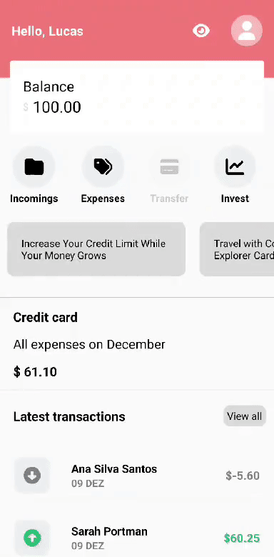
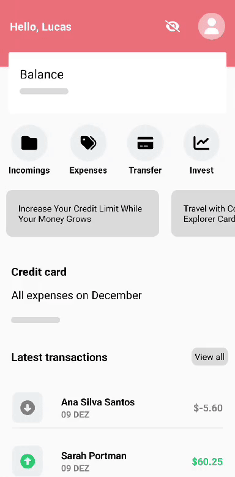
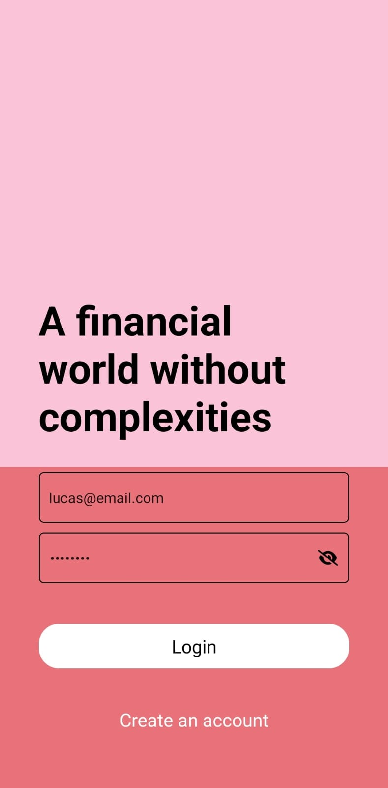
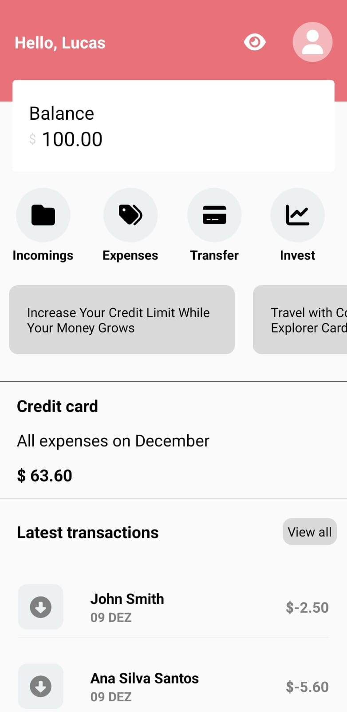
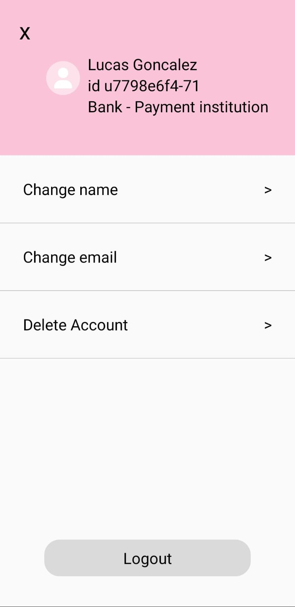
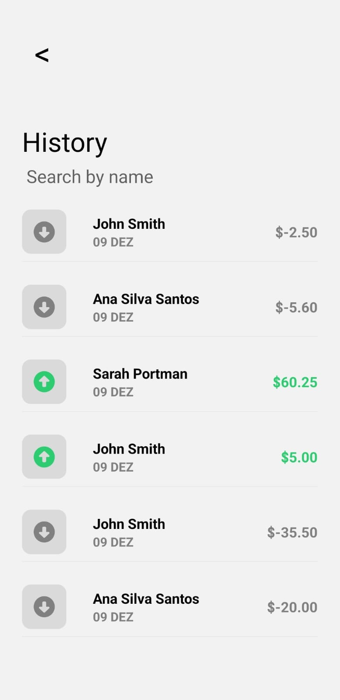

# Bank

<p align="center">
  
  
  
</p>

API Documentation [Here](https://documenter.getpostman.com/view/27685475/2s9YR9aDTu)

## About:
Fullstack mobile app that simulates a fintech platform for receiving and transferring money. The backend API can create and log in users, transfer funds between users, and store transaction records. The frontend allows users to organize transfers with filters and search functionality. Additionally, there is a settings page where users can edit and delete their accounts.

## Functionalities:
- [x]  <strong>Frontend que consome API:</strong> React native frontend app that consumes the backend API
- [x]   <strong>Login:</strong> Users can log in by entering valid email and password credentials. The app authenticates the data, generates an access JWT token, and navigates to the main page.
- [x]  <strong>Sign up Page:</strong> Users can create an account using a unique email. The app generates an access JWT token and directs the user to the main page.
- [x]  <strong>Transfer funds:</strong> Users can transfer funds to other users by specifying the recipient's email and the amount of funds.
- [x]  <strong>Store transaction records:</strong> Each transaction record is stored, displaying the sender, receiver, creation timestamp, amount, and transaction ID.
- [x]  <strong>Edit and delete User info:</strong> Users can update their email and/or name and have the option to delete their account.
- [x]  <strong>Data filters and search functionality:</strong> The frontend provides filters (received and sent) and a search function based on the user's name for organizing transactions.
- [x]  <strong>Create API Documentation:</strong> Create a collection on Postman with the endpoints and all instruction to test the API. [documentation here](https://documenter.getpostman.com/view/27685475/2s9YR9aDTu)


## How to run the back-end project:

```bash
# Clone the project's repository (if not already done in the front-end instructions):
    git clone https://github.com/ojoaoneiva/bank.git

# Enter the back-end paste:
    cd bank
    cd backend

# Create a ".env" file on the back-end folder, using the instructions on the ".env.example" file:

# Run the database migrations::
    npx typeorm migration:run
    
# Install the app's dependencies:
    npm i

# Run the application in developpement mode:
    npm start

# The server will start on localhost:3003
# The API documenter is here: https://documenter.getpostman.com/view/27685475/2s9YXmVzVu
```

## How to run the front-end project:

```bash
# Clone the project's repository (if not already done in the back-end instructions):

# Enter the front-end paste:
    cd ..
    cd front-end

# Install the app's dependencies:
    npm i

# Create a config.js file following the example of the config.example.js file to change where the backend API is running:

# Run the application:
    npx expo

# The server will start on Expo Development.
# Use the Expo Go app on your Android or iOS mobile device to scan the QR code, or use an emulator for desktop viewing.
# Read the API documentation to understand the requests for each endpoint.

```

## Technologies used:
- React Native
- NestJS
- Postgres
- NodeJS
- Typescript
- JWT
- Axios
- Typeorm
- Postman

## Imagens:
<p align="center">
  
  
  
  
  
</p>
